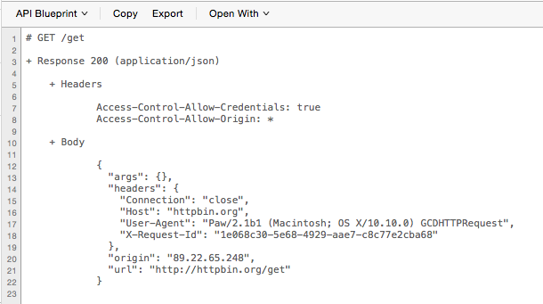

Paw API Blueprint Generator Extension
====================================

[](https://travis-ci.org/apiaryio/Paw-APIBlueprintGenerator)

Paw extension providing support to export API Blueprint as a code generator.



### Installation

The [Paw extension](http://luckymarmot.com/paw/extensions/APIBlueprintGenerator) can be installed with one simple step by clicking [here](paw://extensions/io.apiary.PawExtensions.APIBlueprintGenerator?install).

#### Development Instructions

If you would like to develop the extension, you have follow these steps to get a development environment setup.

##### Clone

First of all, clone this repository in any convenient location (e.g `~/Desktop`).

```bash
$ git clone https://github.com/apiaryio/Paw-APIBlueprintGenerator
```

##### Prerequisites

Install `npm` if needed (e.g. below using [Homebrew](http://brew.sh/)):

```bash
$ brew install npm
```

Install dependencies using `npm`:

```bash
$ npm install
```

##### Development Installation

During development, build the `.js` script using:

```bash
$ cake build
```

To install into the Paw Extension directory:

```bash
$ cake install
```

Alternatively, use the `watch` command to automatically build and install when a file has been modified:

```bash
$ cake watch
```

### License

MIT License. See the [LICENSE](LICENSE) file.
